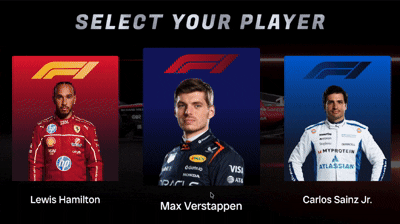
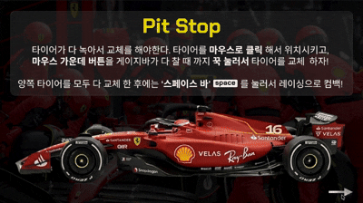

# F1 Racing Game

평소 F1을 좋아해서 영국 Silverstone 서킷을 모방한 맵을 제작하고, 실제 F1 선수들을 선택 가능 플레이어로 구현한 2D 레이싱 게임입니다. 2026년 2학기 지능형게임 수업의 중간 과제로 제출한 개인 프로젝트입니다.

<div align="center">
  <table>
    <tr>
      <td align="center"><br/>Player Select</td>
      <td align="center"><br/>Intro</td>
    </tr>
    <tr>
      <td align="center"><br/>Racing</td>
      <td align="center"><br/>Pit Stop</td>
    </tr>
  </table>
</div>

<br>

## 게임 소개

**SSWU Grand Prix Formula One Championship** — 성신여대를 배경으로 한 가상의 F1 그랑프리입니다.

Max Verstappen, Lewis Hamilton, Lando Norris, Charles Leclerc, Carlos Sainz 5명의 선수 중 하나를 선택해 Silverstone 서킷을 달리며, 레이스 도중 피트스톱 미니게임을 거쳐 레이싱을 완료하게 됩니다. 
<br>

## 씬 구성

| 씬 | 설명 |
|----|------|
| StartScene | 게임 시작 씬 |
| PlayerSelectScene | 선수 및 팀 선택 (Ferrari / McLaren / Red Bull / Williams) 씬|
| IntroScene | 레이싱 게임 시작 대기 씬 |
| RacingScene | Silverstone 서킷 레이싱 씬 |
| PitStopScene | 피트스탑 타이어 교체 미니게임 씬 |
| FinishScene | 최종 결과 화면(Lap수, 게임 수행 초(s)) |

<br>

## 구현 기능

과제 조건에 따라 아래 기능을 포함하여 구현하였습니다.

| 조건 | 구현 내용 |
|------|-----------|
| Transform | 차량 이동 및 회전, 카메라 추적 |
| Prefab 생성 및 제어 | 아이템(+/-), 타이어(Soft / Medium / Hard) Prefab 생성 및 제어 |
| Keyboard input | 방향키로 차량 조작 |
| Mouse input | 피트스톱 씬에서 마우스 클릭으로 타이어 교체, 기타 버튼 제어 |
| 충돌 구현 | 체크포인트, 피트스톱 진입 감지, 피니시 라인 트리거, 맵과 자동차 사이의 충돌 구현 |
| Sprite animation | 차량 방향 전환 시 좌/우 타이어 회전 애니메이션 및 불꽃 애니메이션 |

<br>

## 기술 스택


| 구분 | 내용 |
|------|------|
| 엔진 | Unity 6 (6000.4.0f1), URP 2D |
| 언어 | C# |
| 디자인 | Figma |

<br>

## 라이선스 안내

선수 이미지는 F1 공식 홈페이지를 참고하였습니다. 그 외 게임 내 모든 이미지(맵, UI, 차량 그래픽 등)는 Figma를 사용하여 직접 제작 및 수정하였으며, 저작권은 제작자 본인에게 있습니다.

<br>

## 프로젝트 구조

```
Assets/
├── Audio/               # BGM 및 선수별 테마곡
├── Font/                # ChakraPetch
├── Images/              # 차량, 맵, UI, 타이어 등 게임 에셋
├── Scenes/              # IntroScene, StartScene, PlayerSelectScene,
│                        # RacingScene, PitStopScene, FinishScene
└── Scripts/
    ├── GameData.cs
    ├── IntroScene/
    ├── StartScene/
    ├── PlayerSelectScene/
    ├── RacingScene/     # CarController, GameDirector, ItemGenerator 등
    ├── PitStopScene/    # TireGenerator, TireController, ArrowController 등
    └── FinishScene/
```
